# Godot Simple Games


Simple game projects powered by the Godot Engine.  

https://godotengine.org/  
https://docs.godotengine.org/en/stable/  


## Godot: Useful Shortcuts

### Quick Open
To use Quick Open, perform the following keyboard shortcut on Godot editor. 
Be careful, it does not work on script editor so you need to switch to 2D or 
3D Workspace if you use it.

Windows: **Shift + Alt + O**  
macOS: **Shift + Option + O** -or- **Command + P**  

https://www.peanuts-code.com/en/tutorials/gd0009_various_searches/#quick-open  

### Visible Collision Shapes
You can turn on Visible Collision Shapes by checking / enabling:  
- [x] Debug > Visible Collision Shapes


### Nav Agent Avoidance
The Navigation Agent will by default cap the maximum speed of a `CharacterBody2D`,
be sure to update the upper limit from the default 100 px/s.


## Deployment with Python Web Server
Go to Editor > **Manage Export Templates...**.

If you see "Export templates are missing. Download them or install from a file."
Select the "Best Available Mirror" and click **Download and Install**. The
download is about 850 MB. Then close the window.

Then to go Project > Export. It will open a "Presets" window. Click the "Web"
option from the dropdown.

Export the Project to a new `web_export` folder (which you need to create).

| Web Export for Tappy Plane |
| :---: |
| 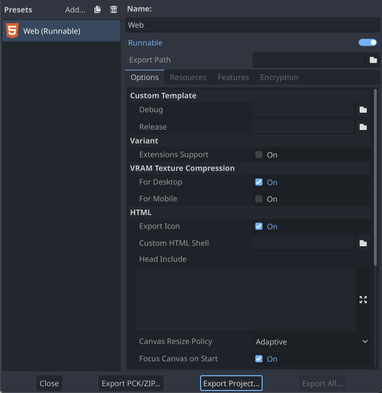 |

In a Terminal instance, navigate to:
```
cd ~/GitProjects/GodotSimpleGames/TappyPlane/web_export
```

Then run this with Python 3 and confirm "Serving HTTP ..." output:
```
$ python -m http.server

Serving HTTP on :: port 8000 (http://[::]:8000/) ...
```

Open this URL in a Browser: http://localhost:8000/  

Click on the `TappyPlane.html` file and you'll see this error:
```
Error
The following features required to run Godot projects on the Web are missing:
Cross Origin Isolation - Check web server configuration (send correct headers)
SharedArrayBuffer - Check web server configuration (send correct headers)
```

Run the `create_server.py` script to create a local server with the proper
configuration:
```
python ./create_server.py
```

Now you should be able to run the game by clicking on the `TappyPlane.html` file!

### Quirk with Memory Madness Deployment
If you follow the above steps, Memory Madness will kind of work... Except all
of the image assets will be missing!


## Asset Links
https://opengameart.org/content/parallax-2d-backgrounds  
https://craftpix.net/freebies/free-cartoon-parallax-2d-backgrounds/?utm_campaign=Website&utm_source=opengameart.org&utm_medium=public  
https://opengameart.org/content/512-sound-effects-8-bit-style  
https://www.kenney.nl/  
https://www.glitchthegame.com/public-domain-game-art/  
https://ansimuz.itch.io/sunny-land-pixel-game-art  
https://pixelfrog-assets.itch.io/pixel-adventure-1  

## Mac Retina Display: Everything is tiny!
1. Open Godot Settings.
2. Check **Advanced Settings** (top-right corner).
3. Go to **Display > Window**.
4. Un-check **DPI > Allow hiDPI**.


# Godot Infrastructure

## Coroutines (and yield)

The `yield` keyword is only for Godot 3.0+. Coroutines are implemented in 
Godot 4.0+ with the `await` keyword.

The await immediately returns a value that may be ignored such that the calling 
function code or the game loop continues to run. But, if you call a function 
containing an `await`, then it becomes a coroutine that can be used with `await` 
in the calling function so that code execution is paused in that calling 
function. Here is an example:

```python
func _ready():
    print("Started")
    try_await()
    print("Done")

func try_await():
    await get_tree().create_timer(1.0).timeout
    print("After timeout")
```

https://gdscript.com/solutions/coroutines-and-yield/

# Tappy Plane
Initial project setup: Open Project > Project Settings.  
Go to Display > Window. Set Viewport Width to 480, and Height to 854.  
Change Handheld > Orientation to **Portrait**.

| Tappy 1 | Tappy 2 |
| :---: | :---: |
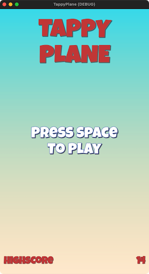 | 

# Angry Animals
A clone of the popular "Angry Birds". Under **Project Settings**, 
Go to Display > Window. Set Viewport Width to 1024, and Height to 600. 
Set **Stretch > Mode** to `canvas_items`.

| Angry Animals 1 |
| :---: |
| 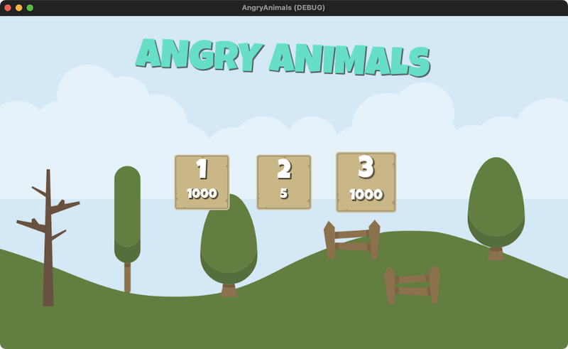 |

| Angry Animals 2 |
| :---: |
| 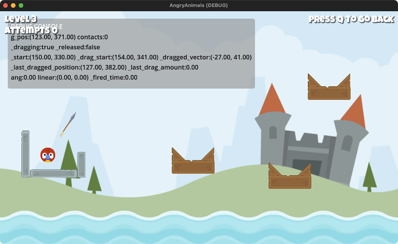 |

# Memory Madness
A tile-flipping memory game where you need to match tiles with the 
same image. Features image randomization and asynchronous data loading 
using Godot Coroutines. Under **Project Settings**, 
Go to Display > Window. Set Viewport Width to 1024, and Height to 768. 
Set **Stretch > Mode** to `canvas_items`.

| Memory Madness 1 |
| :---: |
| 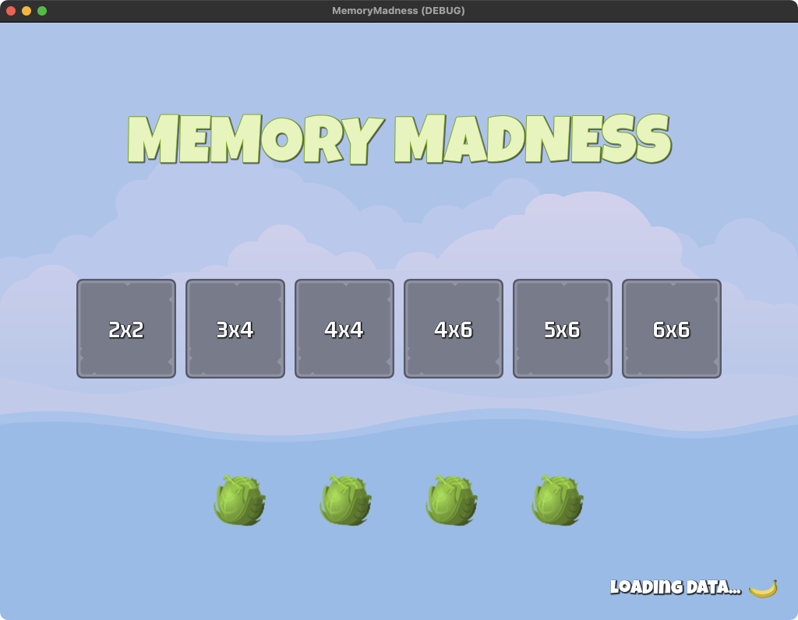 |

| Memory Madness 2 |
| :---: |
| 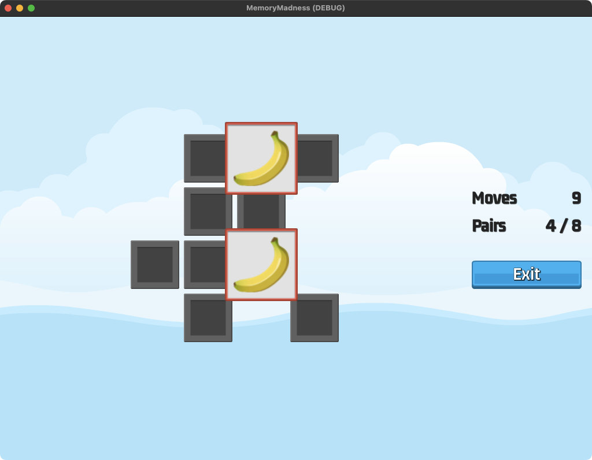 |

# Foxy Antics
A 2D platformer where the player controls a Fox that can shoot projectiles
to destroy wild enemies: Snails, Frogs and Eagles. Features a Boss Ent that
uses an `AnimationNodeStateMachine` to manage transitions to multiple
animations that Scale, Re-Position, and Modulate the Visibility of the boss.

Loosely based on CJ's Elephant Antics for the Commodore 64 and Amiga:  
https://en.wikipedia.org/wiki/CJ's_Elephant_Antics

| Boss Animation Node State Machine |
| :---: |
| 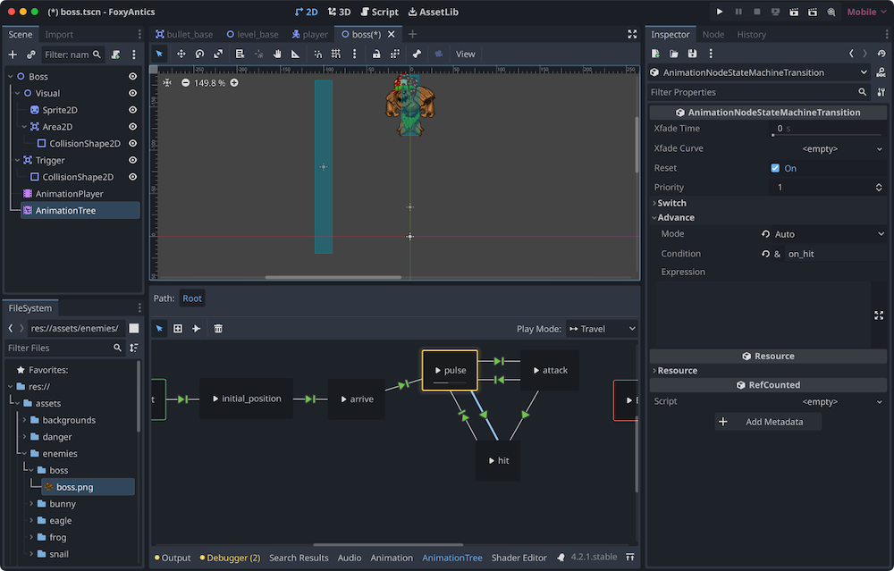 |

| Working with Tile Sets and Collisions |
| :---: |
| 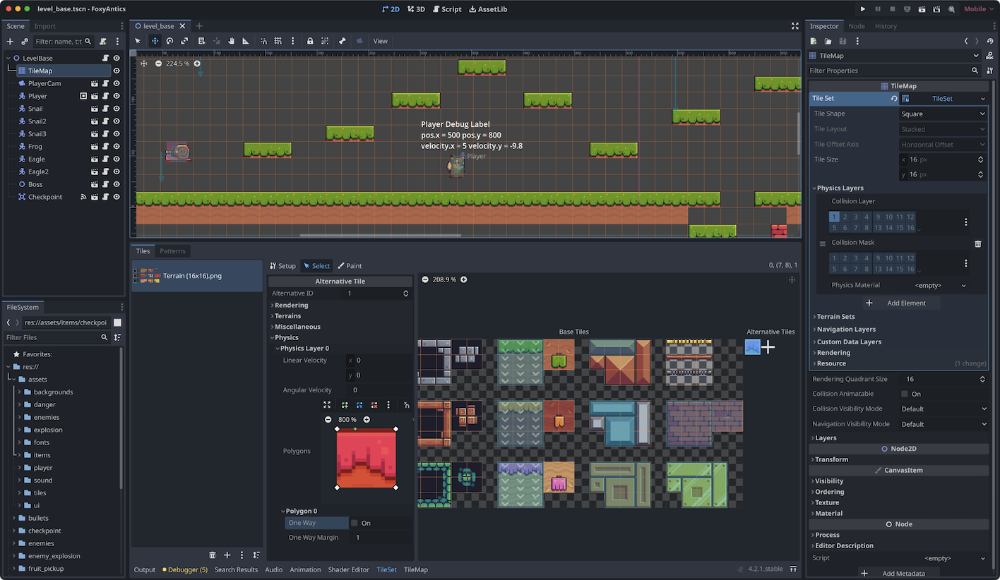 |

| Balls Spikes Hazard moving along a Path2D |
| :---: |
| 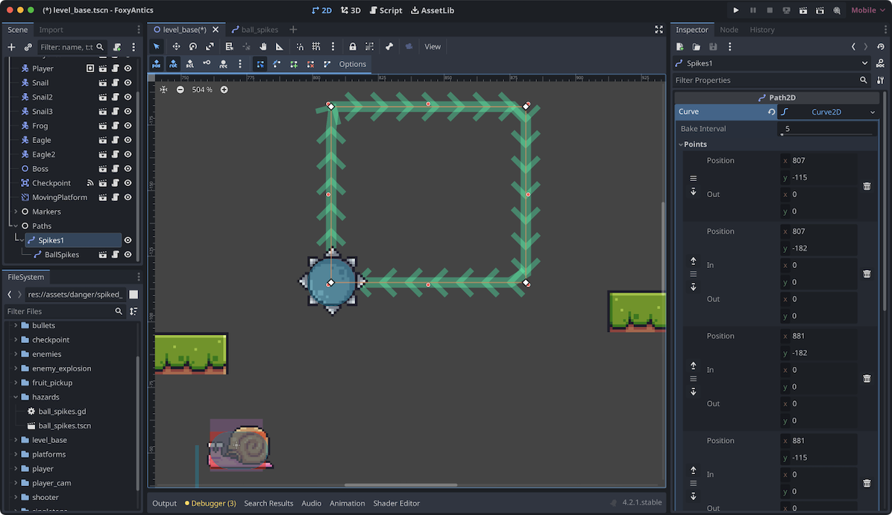 |

| Main Menu with Language Selection |
| :---: |
| 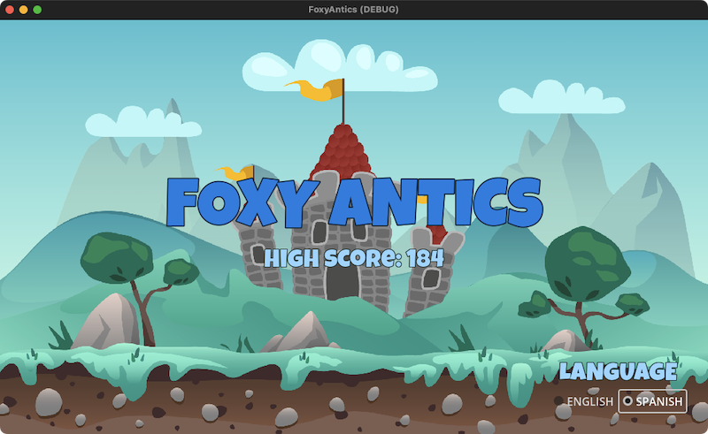 |

| Game Level with Enemy Debug Labels |
| :---: |
| 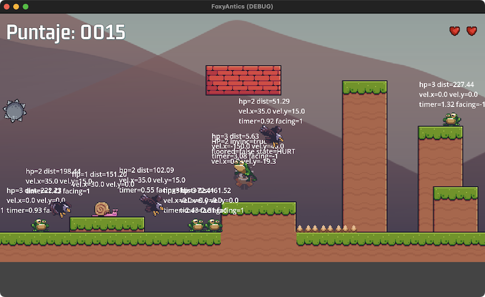 |


# Sokoban (ish)
A puzzle game where the player can push Boxes (Crates) around a 2D tile map
onto floor switches. The level is complete when all floor switches are
activated. Based on the original Sokoban / Box World game. Levels are
programmatically generated using a JSON-to-Tile-Map algorithm using 2D coordinates.

| Level Selection Screen |
| :---: |
| 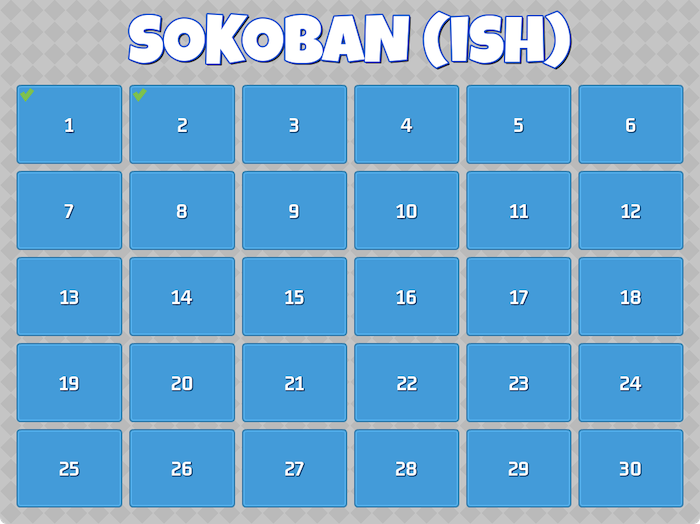 |

| Level Generated from JSON Level Data |
| :---: |
| 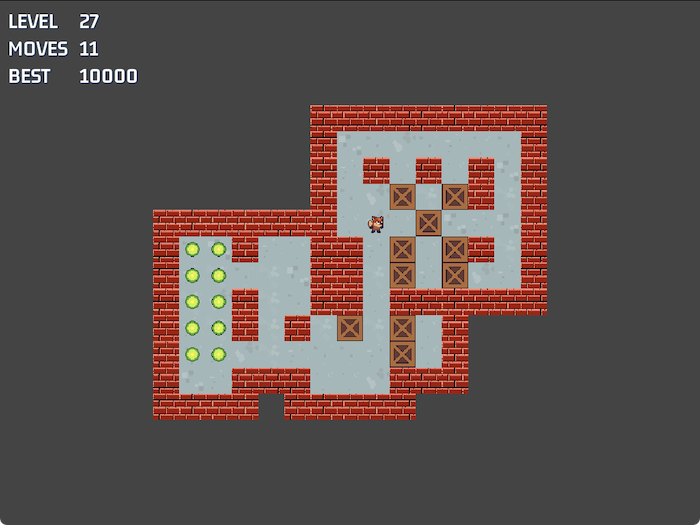 |

| Level Complete UI |
| :---: |
| 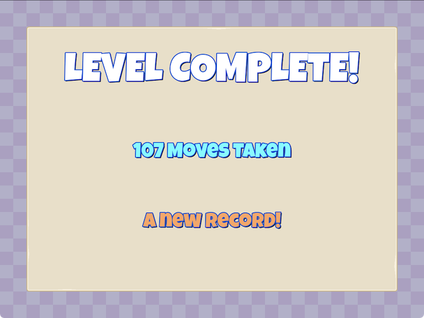 |


# Space Ace (ish)
A top-down Space shooter where the Player controls a Ship that can shoot
lasers and collect Health and Shield powerups. The Game UI and on-screen
enemies have Health Bars that use the `TextureProgressBar` built-in type.
Waves of enemies are driven by Custom Godot Resources, and the enemies
are assigned to a random `Path2D` to follow. The difficulty scales indefinitely
until enemies are so fast, the Player will eventually be overwhelmed.

| Main Menu Screen |
| :---: |
| 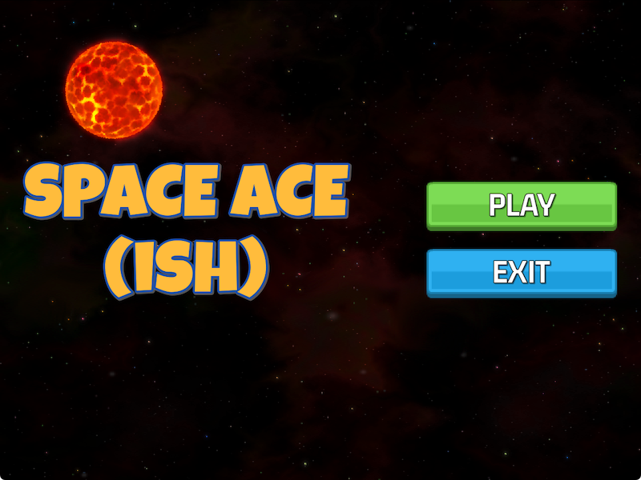 |

| Player Ship Being Attacked by Waves of Enemies |
| :---: |
| 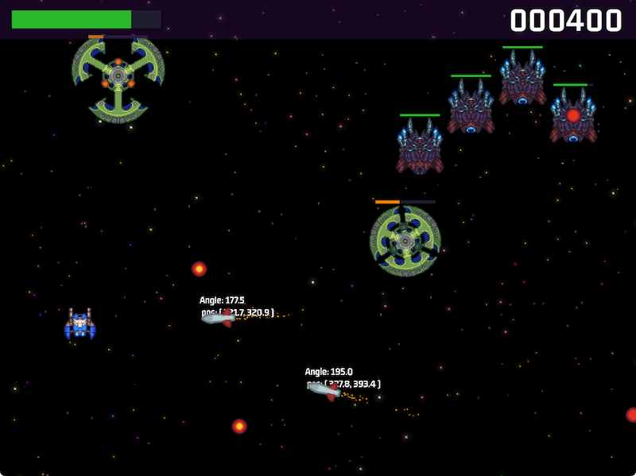 |


# Sneaky Agent
A top-down stealth game (like Metal Gear Solid) where the enemy soldiers have
a Field of View and a Line of Sight to the player. The enemies will pursue
and chase the player, and eventually lose sight of the player if outrun.
Enemies will also shoot bullets at the player, and the player must collect
medication pill `Pickups` to reveal the level exit.

| Main Menu Screen |
| :---: |
| 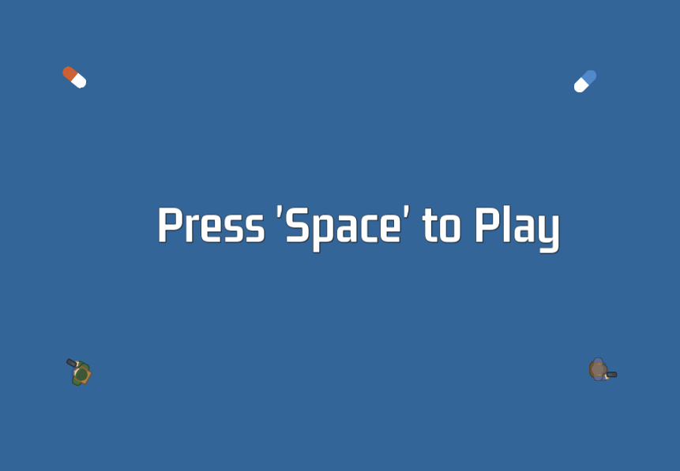 |

| Player Spotted by Enemy Soldiers |
| :---: |
| 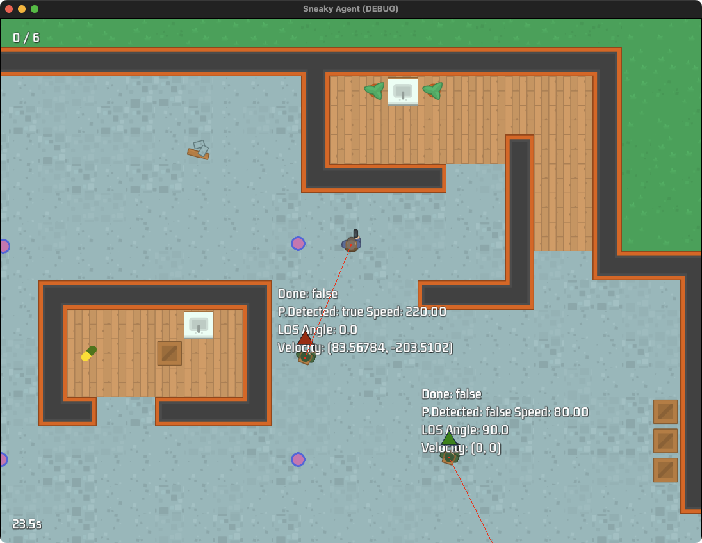 |


# Godot GDScript Style Guide
https://docs.godotengine.org/en/stable/tutorials/scripting/gdscript/gdscript_styleguide.html  
