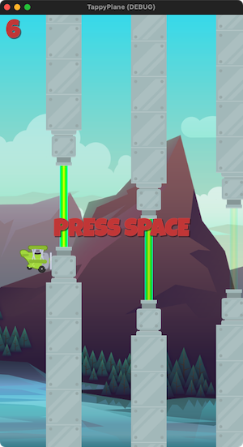

# Godot Simple Games


Simple game projects powered by the Godot Engine.  

https://godotengine.org/  
https://docs.godotengine.org/en/stable/  


## Godot: Useful Shortcuts

### Quick Open
To use Quick Open, perform the following keyboard shortcut on Godot editor. 
Be careful, it does not work on script editor so you need to switch to 2D or 
3D Workspace if you use it.

Windows: **Shift + Alt + O**  
macOS: **Shift + Option + O** -or- **Command + P**  

https://www.peanuts-code.com/en/tutorials/gd0009_various_searches/#quick-open  

### Visible Collision Shapes
You can turn on Visible Collision Shapes by checking / enabling:  
- [x] Debug > Visible Collision Shapes


## Asset Links
https://opengameart.org/content/parallax-2d-backgrounds  
https://craftpix.net/freebies/free-cartoon-parallax-2d-backgrounds/?utm_campaign=Website&utm_source=opengameart.org&utm_medium=public  
https://opengameart.org/content/512-sound-effects-8-bit-style  
https://www.kenney.nl/  
https://www.glitchthegame.com/public-domain-game-art/  
https://ansimuz.itch.io/sunny-land-pixel-game-art  
https://pixelfrog-assets.itch.io/pixel-adventure-1  

## Mac Retina Display: Everything is tiny!
1. Open Godot Settings.
2. Check **Advanced Settings** (top-right corner).
3. Go to **Display > Window**.
4. Un-check **DPI > Allow hiDPI**.


# Godot Infrastructure

## Coroutines (and yield)

The `yield` keyword is only for Godot 3.0+. Coroutines are implemented in 
Godot 4.0+ with the `await` keyword.

The await immediately returns a value that may be ignored such that the calling 
function code or the game loop continues to run. But, if you call a function 
containing an `await`, then it becomes a coroutine that can be used with `await` 
in the calling function so that code execution is paused in that calling 
function. Here is an example:

```python
func _ready():
    print("Started")
    try_await()
    print("Done")

func try_await():
    await get_tree().create_timer(1.0).timeout
    print("After timeout")
```

https://gdscript.com/solutions/coroutines-and-yield/

# Tappy Plane
Initial project setup: Open Project > Project Settings.  
Go to Display > Window. Set Viewport Width to 480, and Height to 854.  
Change Handheld > Orientation to **Portrait**.

| Tappy 1 | Tappy 2 |
| :---: | :---: |
 | 

# Godot GDScript Style Guide
https://docs.godotengine.org/en/stable/tutorials/scripting/gdscript/gdscript_styleguide.html  
